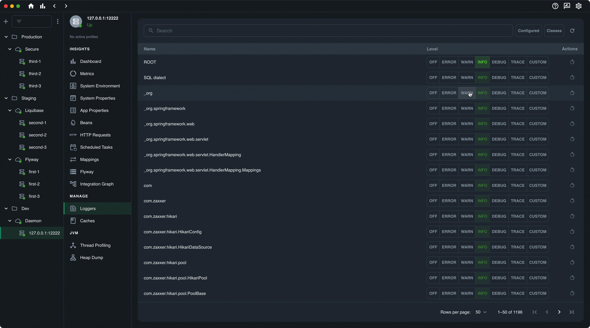

 

    

# Ostara

[Ostara](https://ostara.dev/) is an open source desktop app designed to simplify the management and monitoring of Spring Boot applications. Ostara connects to services using the Spring Boot Actuator API. It’s a Spring Boot Admin alternative that aims to make the process more user-friendly and simplify the setup process by removing the need for dependencies and changes to your code. It allows you to gain insights into application performance, troubleshoot issues, and perform actions on your services across different environments.

    <a href="https://docs.ostara.dev/">DOCS</a> • 
    <a href="https://docs.ostara.dev/getting-started/quick-start">QUICK START</a> • 
    <a href="https://discord.gg/VJ82fuSYxd">COMMUNITY DISCORD</a>
     
    <a href="https://ostara.dev">WEBSITE</a>  •
    <a href="https://github.com/krud-dev/ostara/releases/latest">LATEST RELEASE</a>

## Key Features
* **Effortless Setup** - Download the Ostara application and connect it directly to your Spring Boot Actuator, requiring no additional dependencies or code changes.
* **Application Management** - Monitor and manage multiple environments, and easily sort and group your services based on your environment architecture.
* **Dashboards and Metrics** - Gain insights into service health and performance through multiple dashboards and explore Spring Boot Actuator metrics.
* **View Application Properties** - Access and view all current application properties, including the active Spring profiles.
* **Bean Dependency Graph** - Utilize the unique UI to analyze and improve the decoupling of your application's dependencies.
* **Thread Profiling Tool** - Dive into the internal workings of your application's threads for advanced troubleshooting.
* **Loggers and Caches** - Update log levels and evict caches for single/multiple services with one click.
* **Metric Monitoring and Notifications** - Configure predefined or custom notification rules to receive alerts when your service is degraded.
* **Health Monitoring** - Receive instant notifications when services go down.
* **Import/Export Settings** - Easily share your configuration settings with colleagues.

For a full list of features, [click here](https://docs.ostara.dev/features/abilities).

## Getting Started

Just download the app [latest release](https://github.com/krud-dev/ostara/releases/latest), and add your services. You can check out the full guide [here](https://docs.ostara.dev/getting-started/quick-start).

If you do not have an active service with the Actuator API, no worries! A fully functioning demo service is available in the app.

## System Overview

### Useful Dashboards
View all the important info with the global dashboard, or at specific levels with the instance dashboard, application dashboard and folder dashboard.

### Loggers and Caches
Change log levels and evict cache directly in the UI.

### Demo
Check out this [short demo video](https://www.youtube.com/embed/5KoHNPjBnUk) to see more.

## Support

* **Documentation:** Visit our [documentation site](https://docs.ostara.dev/) for detailed guides, tutorials, and reference materials. It covers installation instructions, usage guidelines, configuration options, and troubleshooting tips. Check it out here.
* **Discord Community:** Join our friendly [Discord community](https://discord.gg/VJ82fuSYxd). It's a great platform to connect with other Ostara users, share experiences, exchange ideas, and seek help. Our community members and team are there to provide support and engage in discussions related to Ostara.
* **Issue Tracker:** If you come across any bugs, have suggestions for improvements, or want to request new features, we encourage you to [open an issue](https://github.com/krud-dev/ostara/issues/new/choose) on our GitHub repository. Our team actively monitors the [issues](https://github.com/krud-dev/ostara/issues) and will respond promptly to address them.
* **Frequently Asked Questions (FAQ):** Check out our [FAQ](https://ostara.dev#faq) section on our homepage. It contains answers to common queries and [technical questions](https://ostara.dev#technical-questions).

We strive to provide timely and effective support to our users. Whether you have technical questions, need guidance, or want to report an issue, we are here to assist you.

## Contributing

We welcome pull requests submissions for any changes or enhancements you'd like to make to Ostara. Whether it's fixing a bug, implementing a new feature, or improving the existing codebase. Please ensure that your pull requests are focused and include a clear description of the changes.

For more detailed information on contributing to Ostara, please refer to our [CONTRIBUTING.md](CONTRIBUTING.md) file. It provides additional guidelines, conventions, and other relevant information to help you get started with your contributions.

## License

Copyright 2023 krud.dev

Licensed under the Apache License, Version 2.0 (the "License");
you may not use this file except in compliance with the License.
You may obtain a copy of the License at

    http://www.apache.org/licenses/LICENSE-2.0

Unless required by applicable law or agreed to in writing, software
distributed under the License is distributed on an "AS IS" BASIS,
WITHOUT WARRANTIES OR CONDITIONS OF ANY KIND, either express or implied.
See the License for the specific language governing permissions and
limitations under the License.

## Special Thanks
These companies have been kind to provide us with free access to their tools for the ongoing development of Ostara, check them out!

 

