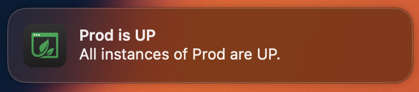
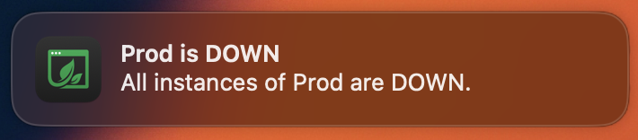

# Health Notifications

## Overview

Ostara sends real-time notifications to keep you informed of any changes in your actuator's health. Each time an application's health status change between Up / Down / Mixed a notification will be sent.

<figure><figcaption></figcaption></figure>

 

<figure><figcaption></figcaption></figure>

Notifications can be disabled or changed to silent mode in the app settings.
