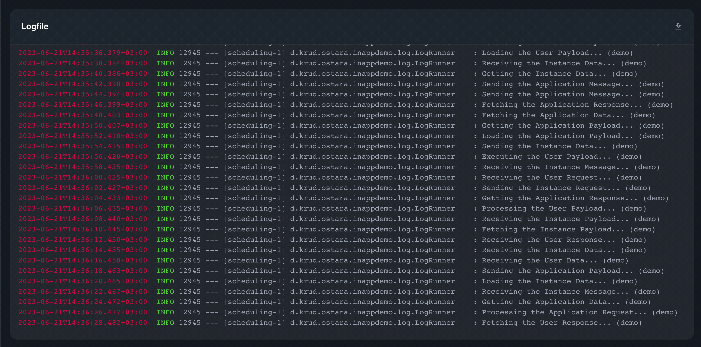
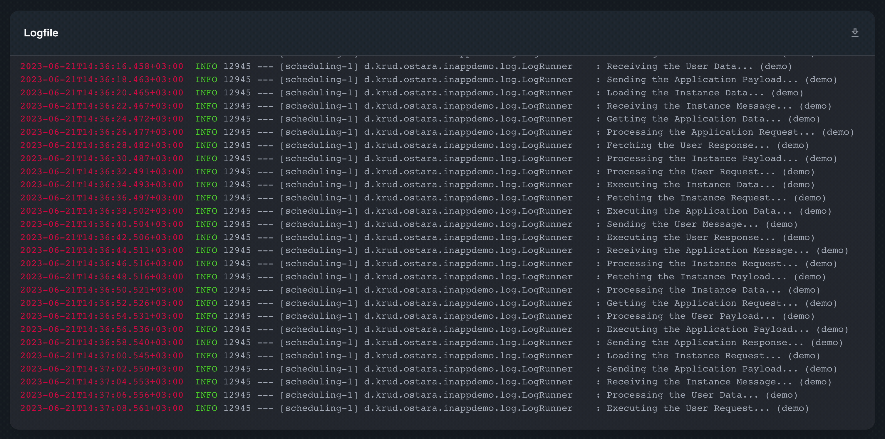

# Logfile

### Overview

Ostara offers the convenience of viewing and downloading the contents of the instance's log file, enabling you to effortlessly access and analyze the log data.

### Usage

Ostara's logfile view presents the log file as a continuous stream of data, displaying the latest information. It provides real-time updates, allowing you to monitor the most recent log entries. However, to access the complete log file containing the entire history of events, it is necessary to download the log file locally.

<figure><figcaption></figcaption></figure>

To download the complete log file, click the download button on the top right:

<figure><figcaption></figcaption></figure>

### Required Abilities

* [Logfile](../../abilities.md)

